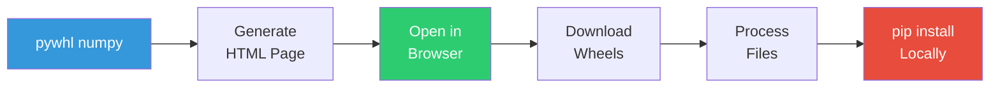

<div align="center">

# 🌐 Pywhl - Python Packages Through Your Browser

<p align="center">
  
  
  
  
</p>

<h3>
  <em>When pip is blocked, use your browser! 🚀</em>
</h3>

<p align="center">
  <a href="#-the-problem">Problem</a> •
  <a href="#-quick-start-30-seconds">Quick Start</a> •
  <a href="#-how-it-works">How it Works</a> •
  <a href="#-installation">Installation</a> •
  <a href="#-faq">FAQ</a>
</p>

</div>

---

## 🚫 The Problem

Working behind a corporate firewall? Can't use pip? We've been there.

```bash
$ pip install numpy
🚫 ERROR: Could not connect to pypi.org (blocked by proxy)
```

## ✅ The Solution

**Your browser can access PyPI? Then you can get packages!**

<div align="center">
  
  
  
</div>

---

## 🚀 Quick Start (30 seconds)

### 1️⃣ Generate Download Links
```bash
pywhl numpy pandas
```

### 2️⃣ Browser Opens → Click & Download

### 3️⃣ Process & Install
```bash
node process-downloads.js
install-wheels.bat
```

**Done!** Your packages are installed. No proxy issues. No IT tickets. 🎉

---

## 📥 Installation

### Option A: Git Clone (Recommended)
```bash
git clone -b lightweight https://github.com/Mrassimo/pywhl.git
cd pywhl
```

### Option B: Download ZIP
[⬇️ Download Latest Release](https://github.com/Mrassimo/pywhl/archive/refs/heads/lightweight.zip)

**Requirements:**
- ✅ Node.js 16+ ([Download](https://nodejs.org))
- ✅ Python 3.7+
- ✅ A web browser
- ❌ No npm install needed!

---

## 📖 How It Works



1. **Smart URL Generation** - Creates download links for PyPI packages
2. **Browser Downloads** - Uses your browser's authenticated connection
3. **Local Processing** - Organizes and prepares packages for installation
4. **Offline Install** - pip installs from local files (no internet needed)

---

## 🎯 Usage Examples

### Basic Usage
```bash
# Single package
pywhl requests

# Multiple packages
pywhl numpy pandas matplotlib

# Specific version
pywhl django==4.2.0

# From requirements file
pywhl -r requirements.txt
```

### Advanced Options
```bash
# Try direct download (if proxy allows)
pywhl --direct numpy

# Show help
pywhl --help
```

---

## 🖥️ Platform Support

| Platform | Command | Tested |
|----------|---------|--------|
| Windows (CMD) | `pywhl.bat <package>` | ✅ |
| Windows (PowerShell) | `.\pywhl.ps1 <package>` | ✅ |
| macOS/Linux | `./pywhl.js <package>` | ✅ |
| Any Platform | `node pywhl.js <package>` | ✅ |

---

## ❓ FAQ

<details>
<summary><b>Why browser mode by default?</b></summary>

Browsers handle proxy authentication automatically. CLI tools often can't authenticate through corporate proxies, but browsers have your credentials and certificates already configured.
</details>

<details>
<summary><b>What if I can't access PyPI from my browser?</b></summary>

You'll need to:
1. Download packages on an unrestricted network
2. Transfer via USB/network share
3. Use `pip install --find-links /path/to/wheels package-name`
</details>

<details>
<summary><b>How do I know which wheel to download?</b></summary>

The HTML page color-codes wheels:
- 🟢 **Green**: Universal (works everywhere)
- 🟡 **Yellow**: Platform-specific
- 🔴 **Red**: Source (needs compilation)

For Windows 64-bit, look for `win_amd64`. For any platform, `py3-none-any` works.
</details>

<details>
<summary><b>Can I use this offline?</b></summary>

Yes! After downloading packages once, they're cached locally. You can:
- Share the cache folder with colleagues
- Build offline bundles
- Install without internet using the cache
</details>

---

## 🛠️ Troubleshooting

| Issue | Solution |
|-------|----------|
| "Node.js not found" | Install Node.js from [nodejs.org](https://nodejs.org) |
| "Cannot download from PyPI" | Your browser might be blocked too - try a different network |
| "Wrong platform wheel" | Download the universal wheel (`py3-none-any.whl`) |
| "Module not found" | Make sure you're in the pywhl directory |

---

## 🤝 Contributing

We love contributions! Whether it's:
- 🐛 Bug reports
- 💡 Feature suggestions
- 📝 Documentation improvements
- 🔧 Code contributions

Please check out our [Contributing Guide](CONTRIBUTING.md) to get started.

---

## 📚 Documentation

- 📖 [Browser Mode Guide](docs/BROWSER-MODE-GUIDE.md)
- 🏢 [Corporate Proxy Solutions](docs/CORPORATE-PROXY-SOLUTIONS.md)
- 💼 [Work PC Setup Guide](docs/WORK-PC-GUIDE.md)
- 🔀 [Development & Merging](docs/MERGE-STRATEGY.md)

---

## 🙏 Acknowledgments

Built with frustration and coffee ☕ by developers stuck behind corporate firewalls.

Special thanks to:
- The Python community for making amazing packages
- Node.js for being available when pip isn't
- Every developer who's fought with a corporate proxy

---

## 📜 License

MIT License - see [LICENSE](LICENSE) file for details.

---

<div align="center">

**If your browser can see it, pywhl can download it!** 🌐✨

<sub>Made with ❤️ for developers in restricted environments</sub>

</div>