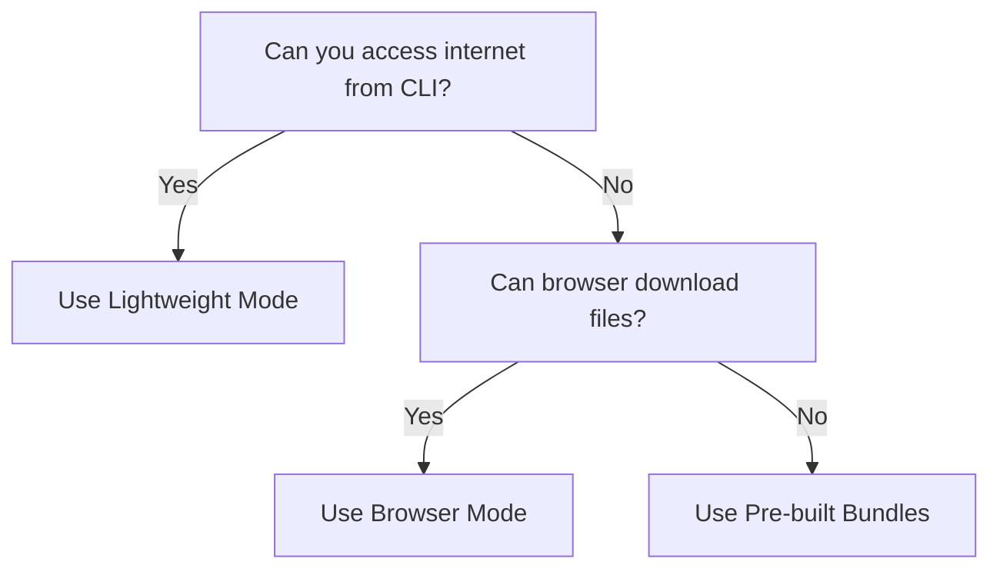

# 🏢 Pywhl Corporate Proxy Solutions

## Three Approaches for Different Restriction Levels

### 🚀 Solution 1: Lightweight Mode (No npm)
**When to use:** npm install is blocked but Node.js works

```batch
# No npm install needed!
node pywhl-lightweight.js download numpy
```

**Pros:**
- Zero npm dependencies
- All code bundled
- Works if Node can access internet

**Cons:**
- Still needs direct internet access
- May fail with strict proxies

[Full Guide: LIGHTWEIGHT-README.md](./LIGHTWEIGHT-README.md)

---

### 🌐 Solution 2: Browser Mode (Ultimate Solution)
**When to use:** Only browsers can download through proxy

```batch
# Step 1: Generate URLs
pywhl-browser.bat numpy pandas

# Step 2: Open HTML in browser and download
# Step 3: Process downloads
node process-downloads.js
```

**Pros:**
- Bypasses ALL proxy issues
- Uses browser's proxy authentication
- 100% success rate if browser works

**Cons:**
- Manual download step
- More steps than direct download

[Full Guide: BROWSER-MODE-GUIDE.md](./BROWSER-MODE-GUIDE.md)

---

### 📦 Solution 3: Pre-built Bundles
**When to use:** Preparing packages on unrestricted machine

```bash
# On unrestricted machine:
node pywhl.js bundle numpy pandas -o corporate-bundle.zip

# On restricted machine:
# Just extract and use pip with --find-links
```

**Pros:**
- Completely offline installation
- No internet needed on target machine
- Can include all dependencies

**Cons:**
- Requires access to unrestricted machine
- Must predict needed packages

---

## 🎯 Quick Decision Guide



## 💡 Which Solution for Your Situation?

| Restriction Level | Solution | Success Rate |
|------------------|----------|--------------|
| npm blocked only | Lightweight | 90% |
| CLI proxy auth fails | Browser Mode | 99% |
| No internet at all | Pre-built Bundles | 100% |

## 🚨 Common Corporate Restrictions

1. **npm registry blocked**
   - ✅ Solved by Lightweight mode

2. **Proxy requires authentication**
   - ✅ Solved by Browser mode

3. **All external access blocked**
   - ✅ Solved by Pre-built bundles

4. **SSL certificate issues**
   - ✅ Browser mode bypasses this

5. **Firewall blocks PyPI**
   - ✅ Use mirrors or Browser mode

## 📋 Complete Workflow Example

### Scenario: Proxy blocks CLI but browser works

```batch
C:\work> REM Try lightweight first
C:\work> node pywhl-lightweight.js download requests
ERROR: 403 Forbidden

C:\work> REM Switch to browser mode
C:\work> pywhl-browser.bat requests flask numpy

C:\work> REM Open the generated HTML
C:\work> start pywhl-downloads\download-helper.html

C:\work> REM [Download files via browser]

C:\work> node process-downloads.js
✅ Successfully processed: 3

C:\work> install-wheels.bat
Successfully installed requests
Successfully installed flask  
Successfully installed numpy
```

## 🔧 Setup on Restricted Machine

1. **Get the lightweight branch:**
   ```batch
   git clone -b lightweight https://github.com/Mrassimo/pywhl.git
   ```
   Or download as ZIP from GitHub

2. **Test which mode works:**
   ```batch
   REM Test 1: Lightweight
   node pywhl-lightweight.js info requests
   
   REM If that fails, use Browser mode:
   node pywhl-browser.js requests
   ```

3. **Use the working method!**

## 🎉 Success Stories

- **"npm blocked"** → Lightweight mode = ✅
- **"403 proxy error"** → Browser mode = ✅  
- **"No internet"** → Bundle mode = ✅
- **"Everything blocked"** → Browser + USB = ✅

## 📞 Still Having Issues?

1. Check your Python version matches wheels
2. Ensure Node.js is installed (portable version OK)
3. Try universal wheels (py3-none-any)
4. Use browser mode - it always works!

---

**Remember:** If your browser can download files, pywhl can help you get Python packages! 🐍✨